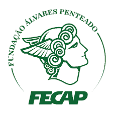
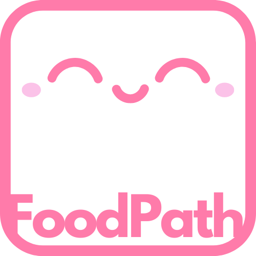

# 🌱 **FoodPath**

<div align="center">
  
  
</div>

O **FoodPath** é um projeto que visa conscientizar as pessoas sobre a situação da fome no Brasil, incentivando doações para ONGs e instituições que combatem essa causa. Através de uma plataforma interativa e informativa, o usuário pode entender melhor o problema e contribuir com doações.

## 🛠️ **Tecnologias Utilizadas**

- **Front-end**: React, JavaScript, HTML, CSS, Bootstrap
- **Back-end**: Node.js com Express
- **Banco de Dados**: MySQL

## 🎯 **Objetivos**

O objetivo principal do FoodPath é contribuir para o **Objetivo de Desenvolvimento Sustentável (ODS)** de **erradicação da fome**. Ao conectar doadores e organizações, buscamos criar um impacto social positivo através da tecnologia.

## 📊 **Dados e Análise**

O site contabiliza as doações e redirecionamentos feitos para ONGs localizadas em diferentes regiões, utilizando essa informação para gerar gráficos e análises que mostram a distribuição de redirecionamentos, destacando os locais com mais e menos contribuições.

## 👥 **Integrantes do Projeto**

- Gustavo Oliveira Demetrio
- Felipe Vallim Soares
- Pedro Della Rosa Antônio
- Saulo Pereira de Jesus
- Carlos Roberto Santos Latorre

## 💻 **Como Rodar o Projeto**

1. Clone o repositório:
   ```bash
   git clone https://github.com/2024-2-NCC2/Projeto1.git
    ```
   ou
   ```bash
   git clone https://github.com/saulosw/foodpath-FECAP.git
   ```
2. Instale as dependências:
   ```bash
    npm install
   ```
3. Rode o servidor:
   ```bash
    npm run dev
   ```
## 📄 **Licença**

<p xmlns:cc="http://creativecommons.org/ns#" xmlns:dct="http://purl.org/dc/terms/">
  <a property="dct:title" rel="cc:attributionURL" href="https://github.com/2024-2-NCC2/Projeto1">FoodPath</a> 
  by <span property="cc:attributionName">Gustavo Demetrio, Felipe Soares, Pedro Della Rosa, Saulo Pereira, Carlos Roberto</span> 
  is licensed under 
  <a href="https://creativecommons.org/licenses/by-nc/4.0/?ref=chooser-v1" target="_blank" rel="license noopener noreferrer" style="display:inline-block;">
    CC BY-NC 4.0
    
    
    
  </a>
</p>
