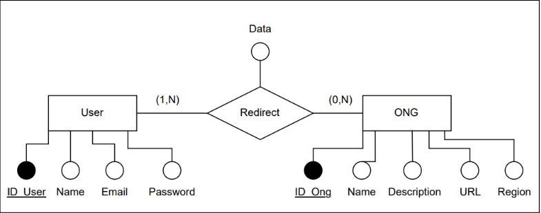

# 🌱 FoodPath

## 🌍 Introdução

O sistema **FoodPath** foi criado para conscientizar as pessoas sobre a fome e incentivar doações para ONGs que trabalham nessa causa. Nele, os usuários podem explorar ONGs, aprender mais sobre suas atividades e serem redirecionados para seus sites, onde poderão realizar doações. Todo esse processo é apoiado por um banco de dados que registra as interações entre os usuários e as ONGs, permitindo que o sistema acompanhe as doações e redirecionamentos.

## 🛠️ Mini Mundo

Um usuário se inscreveu no sistema do **FoodPath** após descobrir a importância de ajudar no combate à fome. Ao se cadastrar, ele fornece seu **Nome**, **Email** e **Senha**, que são armazenados no banco de dados na tabela **User**. Essa tabela guarda as informações de todos os usuários do site, permitindo sua identificação e autenticação no sistema.

Logo após completar seu cadastro, o usuário navega pela página inicial do **FoodPath**, onde encontra uma lista de ONGs que estão cadastradas no sistema. Cada ONG possui um **Nome**, uma descrição detalhada de suas atividades, o **URL** do site onde recebem doações e a **Região** geográfica onde atuam. Essas informações são armazenadas na tabela **ONG**, que mantém o registro de todas as organizações parceiras do **FoodPath**.

Motivado a contribuir, o usuário decide explorar as ONGs e escolhe uma ONG que atua em sua região para conhecer melhor. Ele clica no botão "Doar" associado a essa ONG, que redireciona para o site da organização, onde as doações são feitas diretamente. No momento em que o usuário clica no botão, o sistema cria um registro na tabela **Redirect**, vinculando o **ID_User** do usuário ao **ID_Ong** da ONG escolhida. Esse redirecionamento é armazenado junto com a **Data** em que ocorreu, possibilitando ao sistema acompanhar quantas vezes uma determinada ONG foi visitada e quantos usuários foram direcionados a ela.

Cada interação que ocorre no **FoodPath** é registrada no banco de dados, e esses registros são usados para gerar relatórios que ajudam a entender o comportamento dos usuários. A partir dessas informações, o sistema é capaz de medir o impacto de cada ONG na plataforma, promovendo organizações que precisam de mais visibilidade e apoio, e monitorando o engajamento dos usuários com a causa.

## 📊 Entidades e seus Atributos

- **User (ID_User\*, Name, Email, Password)**  
- **ONG (ID_Ong\*, Name, Description, URL, Region)**  
- **Redirect (ID_User\*, ID_Ong\*, Data)**

## 💻 Tecnologias

O sistema **FoodPath** adota um banco de dados relacional baseado em **SQL** porque esse modelo permite organizar e acessar dados de maneira eficiente, especialmente em sistemas que exigem relações claras entre diferentes entidades. Como nossa aplicação trabalha com o cadastro de usuários, ONGs e redirecionamentos, a estrutura relacional do SQL é ideal para mapear essas relações de maneira eficiente.

Com base nisso, escolhemos o **MySQL** como a tecnologia de banco de dados. Ele é uma solução robusta e amplamente usada, que suporta o modelo relacional e oferece ótima integração com o backend em **Node.js**, que utilizamos no projeto. O **MySQL** também é conhecido por seu bom desempenho e escalabilidade, fatores cruciais à medida que o número de usuários e ONGs na plataforma cresce.

## 📋 Conclusão

O mini mundo exemplifica como os usuários interagem com o banco de dados do sistema ao navegar pelo site e redirecionar para ONGs. Cada ação realizada é registrada no banco de dados, permitindo que o site acompanhe o comportamento dos usuários e forneça informações necessárias para aplicação.