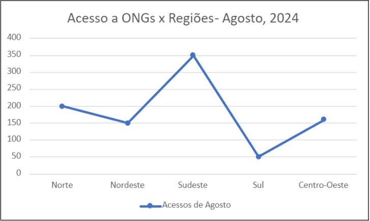

# Cálculo II - Entrega 1

## 1. Coleta de Dados de Doações por Região 📊
No projeto **FoodPath**, será implementado um sistema que contabiliza os redirecionamentos feitos para ONGs localizadas em diferentes regiões, como **Norte**, **Nordeste**, **Sudeste**, **Sul** e **Centro-Oeste**. Cada vez que um usuário for redirecionado para a página de uma ONG, a região dessa organização será registrada. Isso permitirá que os dados sejam organizados e analisados posteriormente, possibilitando a criação de gráficos que mostrem a distribuição dos redirecionamentos para as ONGs entre as regiões.

## 2. Análise de Máximos e Mínimos 📈
Além disso, será realizada uma análise dos pontos de máximo e mínimo nos redirecionamentos para identificar possíveis desequilíbrios entre as diferentes regiões. Esse estudo ajudará a entender quais áreas estão recebendo mais ou menos acessos ao longo de um determinado período. A partir dessa análise, será possível obter informações valiosas para o projeto, como a porcentagem de redirecionamentos para cada região em relação ao total de acessos no site.

Também será possível observar como o número de redirecionamentos varia ao longo do tempo, identificando períodos de maior ou menor atividade, o que pode ajudar a entender fatores sazonais que influenciam esses acessos. Além disso, a comparação entre as regiões permitirá destacar quais áreas estão recebendo mais atenção dos usuários, ajudando no planejamento de futuras campanhas que incentivem o apoio às regiões menos favorecidas.

## Exemplo 💡

